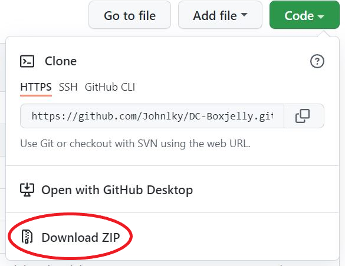

# Installation manual
 
## Introduction

This installation manual aims to help deploy and install our Digital Calibration application in the Windows10 environment based on our development experience. The main contents cover the essentials for development and runtime environment, troubleshooting etc.

## Pre-Installation Requirements

* Windows10
* Python >= 3.6. The download link: [https://www.python.org/downloads/](https://www.python.org/downloads/)
    * To develop the program using Pipenv, the version needs to be exactly `3.6`.
* Excel: Our product uses Excel to generate intermediate template files.
* PDF viewers such as Adobe Acrobat Reader DC are required to open the final report
* pip: pip is the package installer for Python. 
* Pipenv: Not necessary, but it is essential for development. Pipenv is a tool that can manage virtual environments and packages for development. It can be installed simply as:

        pip install --user pipenv

* Git or Github: The source code can be cloned or downloaded directly from our repo. Link: [https://github.com/Johnlky/DC-Boxjelly](https://github.com/Johnlky/DC-Boxjelly)

## Installation Steps

1. Specify a location and open the command prompt. Then type:

        git clone https://github.com/Johnlky/DC-Boxjelly.git

    If the condition is not met, you can simply download the ZIP file from our Github homepage as the following figure shows (downloading zip file in the main branch is fine):
    

2. When the clone or unzipping is done, run install.bat in the root folder by double clicking the file or typing ‘install.bat’ in the command line and run.
3. When all packages are installed successfully, you can simply run run.bat file to launch the program. 

**Note: If the required packages are installed, there is no need to run the install.bat.**

## Troubleshooting

* What if I come across “ERROR: Could not install packages due to an OSError: [Errno 13] Permission denied...”

    That means the installation process is not under admin mode. In this case, please right-click the install.bat and click “Run as administrator”
